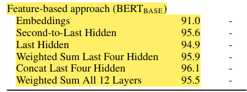

### Bert Architecture

1. read bert paper and annotated it
2. watched umal jamils lecture on bert - https://www.youtube.com/watch?v=90mGPxR2GgY
3. bert scratch implementation - WIP

#### Summary and takeaway

1. Bert is bi-directional that use left and right context.
2. Instead of masking future tokens, they use a Cloze task where they randomly masks some of the tokens from the input, and the objective is to predict the original vocabulary id of the masked word based only on its context.
3. They have a second task to do next sentence prediction.
4. 2 special tokens - [SEP] and [CLS]. The [SEP] is used to seperate two sentences during training and the [CLS] token is used during the classification task ie. after finetuning on a downstream task, you use the final hidden state of this token to do classification . Intuition is it has access to all the tokens of that seqeuence and its more like a weighted average of them all.
5. [MASK] token used during pretraining to randomly mask out words. 15% of the tokens picked where 80% of them masked, 10% random word and 10% unchanged.

6. Using the feature embeddings alone from BERT and using as them as input for a BiLSTM for classification, they observed concatenating the token representations from the top four hidden layers performed best.