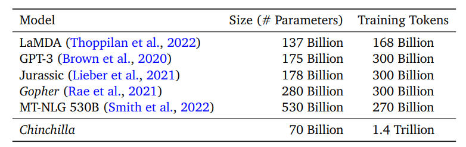
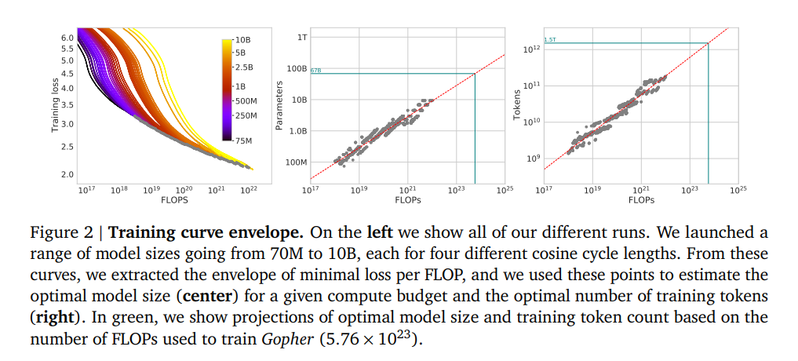
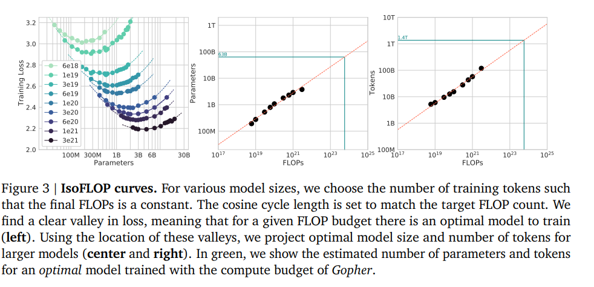
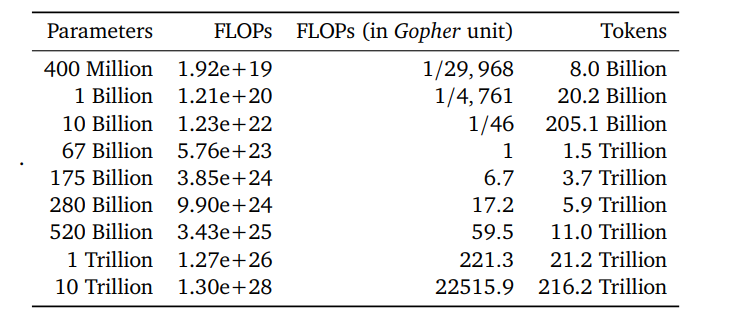

### [Chinchilla Scaling Law Paper](https://arxiv.org/pdf/2203.15556)

Given a particular compute budget, what is the optimal model size and the # of tokens you need to build a strong LLM?

```
By training over 400 language models ranging from 70 million to over 16 billion parameters on 5 to 500 billion tokens, we find that for compute-optimal training, 
the model size and the number of training tokens should be scaled equally: for every doubling of model size the number
of training tokens should also be doubled.
```


```
Kaplan et al. (2020) showed that there is a power law relationship between the number of
parameters in an autoregressive language model (LM) and its performance.
```
meaning if you increase model size N times, you get some X performance increase.

So people have been simply increasing param size without increasing dataset size

```
Specifically, given a 10× increase computational budget, they suggests that the size of the model should increase 5.5× while
the number of training tokens should only increase 1.8×. Instead, we find that model size and the
number of training tokens should be scaled in equal proportions.
```



They had 3 types of experiment they did to find this optimization problem -
Given Compute, find model size and dataset size.

- Experiment 1 - Fix model sizes and vary number of training tokens

They took a fixed model size and trained 4 versions with diffrent token sizes. Then they plotted how the loss curve changed.



- Experiment 2 - Fix the training budget and vary the model size.

Here they are trying to find the optimal model parameters size given a fixed compute budget.



- Experiment 3 - Fit a model on the data they acquired from expt1 and expt2


This is the estimated optimal model size and tokens for a compute budget


