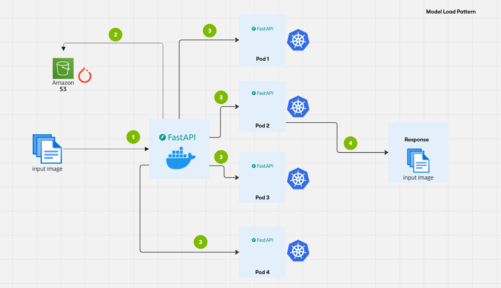

## Model Load Pattern from S3

This pattern pulls the trained model weights from a s3 bucket into a container and serves it for production.



### Workflow

1. **User Uploads Image**: Sends an image to the FastAPI endpoint.
2. **FastAPI Endpoint**: Receives the request and forwards it to one of the Kubernetes replicas.
3. **Kubernetes Load Balancer**: Distributes the request across the 4 replicas.
4. **PyTorch Model in Docker**: The selected replica runs inference using the PyTorch model pulled from the s3 bucket
5. **Prediction Response**: The inference result (ant or bee) is returned to the FastAPI endpoint.
6. **Response to User**: The final classification result is sent back to the user.

### Steps to Run

1. **Start Minikube**

    ```bash
    minikube start --memory 4096
    ```

2. **Build the Images and Push Them to Hub**

    ```bash
    make build
    make push
    ```

3. **Deploy the Kubernetes Pods**

    Wait for the image to be pulled. This may take some time since the Docker image is large.

    ```bash
    make deploy
    ```

4. **Check the Pods**

    ```bash
    kubectl get pods -n model-in-image
    ```

5. **Check the Logs for the Pods**

    ```bash
    kubectl logs -n model-in-image -l app=model-in-image
    ```

    Once the pods are up and running, go to [localhost:8000/docs](http://localhost:8000/docs).

6. **Delete After Use**

    ```bash
    make delete
    ```

7. **Stop Minikube**

    ```bash
    minikube stop
    ```

### Additional Information

- Ensure Docker and Minikube are installed and running on your machine.
- The FastAPI endpoint documentation can be accessed at [localhost:8000/docs](http://localhost:8000/docs) once the service is running.
- For troubleshooting, refer to the logs using the `kubectl logs` command.
- Configure AWS credentials using env variables.

