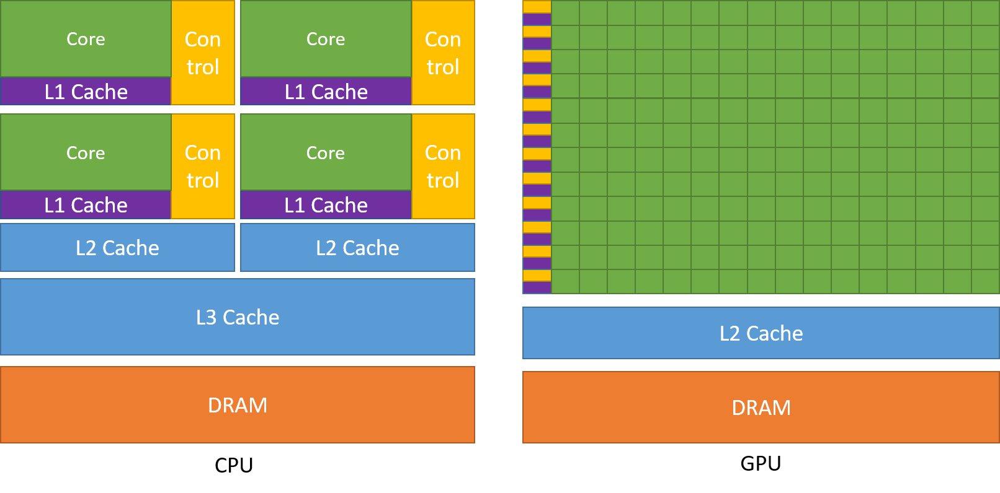
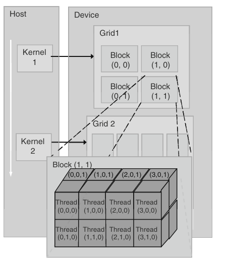

### CUDA C BASICS

CPU VS GPU

CPU is designed to run a sequence of operations as fast as possible.
GPU is designed to run thousands of these operations in parallel, basically higher throughput.

IF you look at the diagram, you can notice that GPU instead of having many controllers and caching devices, it dedicates all of that space for raw computation. It avoids the data access latency unlike CPU and uses them all for computing things.

Note - Before learning CUDA, its a good idea to get familiar with the GPU card you have.

A **kernel** is the program that is run on CUDA by the GPU. They generate a large number of threads to exploit data parallelism. It is identified by the keyword __global__ .

- Host - CPU and its memory
- Device - GPU and its memory

When you run a CUDA program -
1. The input data is first copied from CPU to GPU.
2. Load GPU program and execute.
3. Result is copied back to CPU.

#### The thread hierarchy

When a kernel is launched, a grid of parallel threads are launched.

A grid is split into blocks of threads. So basically grid contain blocks, and blocks contain threads.

All threads inside the same block can access what each other is doing, they have a shared memory, but thread from block 1 cannot talk to a thread from block 2.

Each thread block is, in turn, organized as a three-dimensional array of threads with a total size of up to 1024 threads. 
The coordinates of threads in a block are uniquely defined by three thread indices: threadIdx.x, threadIdx.y, and threadIdx.z.
You can structure the 1024 any way you want, for example, (32, 32, 1).

Because all threads in a grid execute the same kernel, they rely on unique coordinates to distinguish themselves from each other and to identify the appropriate portion of the data to process. These threads are organized into a two-level hierarchy — **blockIdx** and **threadIdx**.

1. If you have a single block with multiple threads, then only thing you need is a **threadIdx**.
2. If you have multiple blocks, then you need to identity the block + the corresponding thread.

Assume a grid has 128 blocks and each block has 32 threads. 
   `blockDim` (number of threads) = 32.
   There are a total of 128 * 32 = 4096 threads in the grid. 

Thread 3 of Block 0 accesses the idx 0 * 32 + 3 = 3 
Thread 3 of Block 5 accesses 5 * 32 + 3 = 163
Thread 15 of Block 102 accesses 102 * 32 + 15 = 3279

The common formula is **threadID = blockIdx.x * blockDim.x + threadIdx** 

