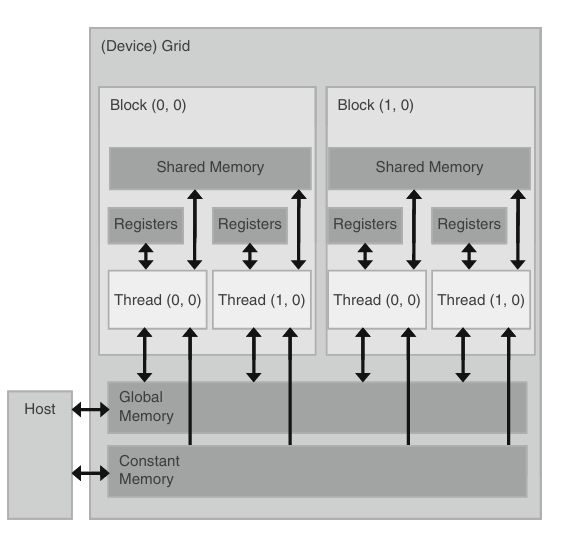

### CUDA C BASICS

CPU VS GPU

CPU is designed to run a sequence of operations as fast as possible.
GPU is designed to run thousands of these operations in parallel, basically higher throughput.

IF you look at the diagram, you can notice that GPU instead of having many controllers and caching devices, it dedicates all of that space for raw computation. It avoids the data access latency unlike CPU and uses them all for computing things.

Note - Before learning CUDA, its a good idea to get familiar with the GPU card you have.

A **kernel** is the program that is run on CUDA by the GPU. They generate a large number of threads to exploit data parallelism. It is identified by the keyword __global__ .

- Host - CPU and its memory
- Device - GPU and its memory

When you run a CUDA program -
1. The input data is first copied from CPU to GPU.
2. Load GPU program and execute.
3. Result is copied back to CPU.

#### The thread hierarchy

When a kernel is launched, a grid of parallel threads are launched.

A grid is split into blocks of threads. So basically grid contain blocks, and blocks contain threads.

All threads inside the same block can access what each other is doing, they have a shared memory, but thread from block 1 cannot talk to a thread from block 2.

Each thread block is, in turn, organized as a three-dimensional array of threads with a total size of up to 1024 threads. 
The coordinates of threads in a block are uniquely defined by three thread indices: threadIdx.x, threadIdx.y, and threadIdx.z.
You can structure the 1024 any way you want, for example, (32, 32, 1).

Because all threads in a grid execute the same kernel, they rely on unique coordinates to distinguish themselves from each other and to identify the appropriate portion of the data to process. These threads are organized into a two-level hierarchy — **blockIdx** and **threadIdx**.

1. If you have a single block with multiple threads, then only thing you need is a **threadIdx**.
2. If you have multiple blocks, then you need to identity the block + the corresponding thread.

Assume a grid has 128 blocks and each block has 32 threads. 
   `blockDim` (number of threads) = 32.
   There are a total of 128 * 32 = 4096 threads in the grid. 

Thread 3 of Block 0 accesses the idx 0 * 32 + 3 = 3 
Thread 3 of Block 5 accesses 5 * 32 + 3 = 163
Thread 15 of Block 102 accesses 102 * 32 + 15 = 3279

The common formula is **threadID = blockIdx.x * blockDim.x + threadIdx** 

#### Streaming multiprocessors

A GPU is built around an array of Streaming Multiprocessors (SMs). A multithreaded program is partitioned into blocks of threads that execute independently from each other, so that a GPU with more multiprocessors will automatically execute the program in less time than a GPU with fewer multiprocessors.

Each block will start on one SM and will remain there until it has completed. As soon as it has completed it will retire and another block can be launched on the SM. It's this dynamic scheduling that gives the GPUs the scalability - if you have one SM then all blocks run on the same SM on one big queue, if you have 30 SMs then the blocks will be scheduled across the SMs dynamically. So you should ensure that when you launch a GPU function your grid is composed of a large number of blocks (at least hundreds) to ensure it scales across any GPU.

The warp is the unit of thread scheduling in SMs.
A warp is a set of 32 threads (if you have 128 threads in a block (for example) then threads 0-31 will be in one warp, 32-63 in the next and so on.

if a block has 256 threads, then it has 256 / 32 = 8 warps
so 3 blocks has 24 warps.

24 * 32 = 768 threads, in the G80, this is the maximum number of threads an SM can hold, so the max number of warps in this SM block for G80 is 24 warps.

When an instruction executed by the threads in a warp must wait for the result of a previously initiated long-latency operation, the warp is not selected for execution. Another resident warp that is no longer waiting for results is selected for execution. 

If more than one warp is ready for execution, a priority mechanism is used to select one for execution. This mechanism of filling the latency of expensive operations with work from
other threads is often referred to as `latency hiding`.

Note that warp scheduling is also used for tolerating other types of long latency operations such as pipelined floating-point arithmetic and branch instructions.
With enough warps around, the hardware will likely find a warp to execute at any point in time, thus making full use of the execution hardware in spite of these long-latency operations. The selection of ready warps for execution does not introduce any idle time into the execution timeline, which is referred to as zero-overhead thread scheduling. 
With warp scheduling, the long waiting time of warp instructions is hidden by executing instructions from other warps. This ability to tolerate long
latency operations is the main reason why graphics processing units (GPUs) do not dedicate nearly as much chip area to cache memories as central processing units (CPUs) do. 
As a result, GPUs can dedicate more of their chip area to floating-point execution resources.

#### Memory

When you launch a kernel, The data to be processed by these threads are first transferred from the host memory to the device global memory.
The threads then access their portion of the data from the global memory using their blockIDs and threadIDs.

Although this is a very good start, these simple CUDA kernels will likely achieve only a small fraction of the potential speed of the underlying hardware.
The poor performance is due to the fact that global memory, which is typically implemented with dynamic random access memory(DRAM), tends to have long access latencies and finite access bandwidth.

The Compute-to-Global-Memory-Access (CGMA) ratio is a measure of how many floating-point operations are performed per access to global memory. It is defined as:

` CGMA = Number of Floating-Point Operations / Number of Global Memory Accesses   `
​
 A higher CGMA ratio means that a CUDA kernel performs more computations relative to memory accesses, leading to better efficiency and performance. Conversely, a lower CGMA ratio means that the kernel spends more time fetching data from memory instead of performing useful computations.

for matrix mul, you have (one multiplication + one addition) and two memory accesses,
therefore 

`CGMA = 2 / 2 = 1`

My GPU for instance has a global memory bandwidth of 288 GB/sec.
Now a single precision floating values needs 32 bits or 4 bytes of memory.

so the max number of single precision floats that can be loaded per second is
`72 billion floating point operations` ( 288 / 4)

Since the CGMA ratio is 1.0, each floating-point operation requires one memory access. Thus, the maximum achievable floating-point operations per second (FLOPS) is limited by the rate at which data is fetched. `72 gigaflops = 72 billion floating-point operations per second`

Even though the  GPU has a peak floating-point performance of 344 gigaflops, the matrix multiplication kernel achieves only 72 gigaflops due to memory bandwidth limitations.

Global memory access in CUDA is very slow (hundreds of clock cycles per access), while computations in GPU cores are much faster. Since the kernel relies heavily on global memory for every floating-point operation, it spends more time waiting for data rather than performing computations.

Memory types

1. Global memory - read and write by the host.
2. Constant memory -  supports short-latency, high-bandwidth, read-only access by the device when all threads simultaneously access the same location.
3. Registers and shared memory - they are present on-chip and any variables you store here can be accessed at extremely high speeds.

Every thread will have its own register. A kernel uses registers to hold frequently accessed variables that are private to each thread.
Shared memory is given to blocks, where all threads from the same block can access the variables across all the threads

Using shared memory instead of global memory to optimize

take matrix mul for example, each thread computes one output element by iterating through a row of Matrix A and a column of Matrix B. This results in:
- Redundant global memory accesses: Each element of A and B is loaded from global memory multiple times.
- Memory bandwidth bottleneck: Since global memory is slow, fetching the same data multiple times wastes time and bandwidth.

Tiling
- Divide the matrices into small blocks (tiles).
- Load these tiles into shared memory (which is much faster than global memory).
- Perform computations within shared memory before moving to the next tile.

This allows each loaded value to be used multiple times, reducing global memory bandwidth usage and increasing the CGMA ratio.

#TO-DO (explain in detail with a cuda program)

Memory limit 

Every tho registers, shared memory is fast, there is a memory limit and we need to make sure we dont exceed them. In general, the more memory locations
each thread requires, the fewer the number of threads that can reside in each SM and thus the fewer number of threads that can reside in the entire processor.

Take g80 card,
each SM has 8192 registers, for the entire processor we have 128k registers. 
This is a very large number but it only allows each thread to use a very limited number of registers.

one SM(in g80) can have max 768 threads, to fill this capacity, each thread can access 8k / 768 = 10 registers. IF the thread uses 11 registers, the number of concurrent threads running will drop down for the SM.

Shared memory usage can also limit the threads per SM.

one SM say can accomodate 8 blocks.
one SM has 16kb of shared memory.

each block should not take more than 2kb of shared memory. If each block uses more than 2 kB of memory, the number of blocks that can reside in each SM is such that the total amount of shared memory used by these blocks does not exceed 16 kB; for example, if each block uses 5 kB of shared memory, no more than 3 blocks can be assigned to each SM.

### Performance

