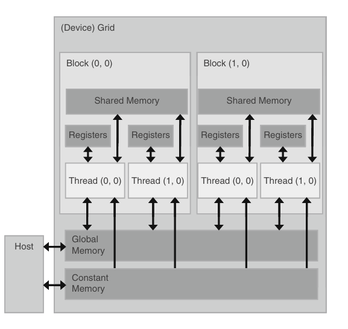

#### Memory

When you launch a kernel, The data to be processed by these threads are first transferred from the host memory to the device global memory.
The threads then access their portion of the data from the global memory using their blockIDs and threadIDs.

Although this is a very good start, these simple CUDA kernels will likely achieve only a small fraction of the potential speed of the underlying hardware.
The poor performance is due to the fact that global memory, which is typically implemented with dynamic random access memory(DRAM), tends to have long access latencies and finite access bandwidth.

The Compute-to-Global-Memory-Access (CGMA) ratio is a measure of how many floating-point operations are performed per access to global memory. It is defined as:

` CGMA = Number of Floating-Point Operations / Number of Global Memory Accesses   `
​
 A higher CGMA ratio means that a CUDA kernel performs more computations relative to memory accesses, leading to better efficiency and performance. Conversely, a lower CGMA ratio means that the kernel spends more time fetching data from memory instead of performing useful computations.

for matrix mul, you have (one multiplication + one addition) and two memory accesses,
therefore 

`CGMA = 2 / 2 = 1`

My GPU for instance has a global memory bandwidth of 288 GB/sec.
Now a single precision floating values needs 32 bits or 4 bytes of memory.

so the max number of single precision floats that can be loaded per second is
`72 billion floating point operations` ( 288 / 4)

Since the CGMA ratio is 1.0, each floating-point operation requires one memory access. Thus, the maximum achievable floating-point operations per second (FLOPS) is limited by the rate at which data is fetched. `72 gigaflops = 72 billion floating-point operations per second`

Even though the  GPU has a peak floating-point performance of 344 gigaflops, the matrix multiplication kernel achieves only 72 gigaflops due to memory bandwidth limitations.

Global memory access in CUDA is very slow (hundreds of clock cycles per access), while computations in GPU cores are much faster. Since the kernel relies heavily on global memory for every floating-point operation, it spends more time waiting for data rather than performing computations.

Memory types

1. Global memory - read and write by the host.
2. Constant memory -  supports short-latency, high-bandwidth, read-only access by the device when all threads simultaneously access the same location.
3. Registers and shared memory - they are present on-chip and any variables you store here can be accessed at extremely high speeds.

Every thread will have its own register. A kernel uses registers to hold frequently accessed variables that are private to each thread.
Shared memory is given to blocks, where all threads from the same block can access the variables across all the threads

Using shared memory instead of global memory to optimize

take matrix mul for example, each thread computes one output element by iterating through a row of Matrix A and a column of Matrix B. This results in:
- Redundant global memory accesses: Each element of A and B is loaded from global memory multiple times.
- Memory bandwidth bottleneck: Since global memory is slow, fetching the same data multiple times wastes time and bandwidth.

Tiling
- Divide the matrices into small blocks (tiles).
- Load these tiles into shared memory (which is much faster than global memory).
- Perform computations within shared memory before moving to the next tile.

This allows each loaded value to be used multiple times, reducing global memory bandwidth usage and increasing the CGMA ratio.

#TO-DO (explain in detail with a cuda program)

Memory limit 

Every tho registers, shared memory is fast, there is a memory limit and we need to make sure we dont exceed them. In general, the more memory locations
each thread requires, the fewer the number of threads that can reside in each SM and thus the fewer number of threads that can reside in the entire processor.

Take g80 card,
each SM has 8192 registers, for the entire processor we have 128k registers. 
This is a very large number but it only allows each thread to use a very limited number of registers.

one SM(in g80) can have max 768 threads, to fill this capacity, each thread can access 8k / 768 = 10 registers. IF the thread uses 11 registers, the number of concurrent threads running will drop down for the SM.

Shared memory usage can also limit the threads per SM.

one SM say can accomodate 8 blocks.
one SM has 16kb of shared memory.

each block should not take more than 2kb of shared memory. If each block uses more than 2 kB of memory, the number of blocks that can reside in each SM is such that the total amount of shared memory used by these blocks does not exceed 16 kB; for example, if each block uses 5 kB of shared memory, no more than 3 blocks can be assigned to each SM.