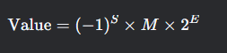
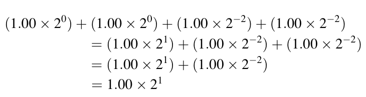
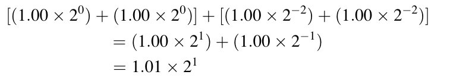

#### Representation of Floating-Point Numbers

A floating-point number in the IEEE 754 standard is represented by three components:

`Sign (S)`: 1 bit that indicates whether the number is positive (0) or negative (1).

`Exponent (E)`: A biased integer that determines the range of the number.

`Mantissa (M)`: A fractional value that determines the precision of the number.

The value of a floating-point number is calculated using the formula:

 
where:

M is the mantissa, normalized such that 1.0 ≤ M < 2.0 (for normalized numbers).
E is the exponent, adjusted by a bias to allow for both positive and negative exponents.

The mantissa M is normalized to ensure a unique representation for each floating-point number. For example, the number 

0.5 = 1.0 × 2^-1
 
The normalization ensures that the mantissa always starts with a leading 1, which can be omitted in the binary representation to save space. This is called the "hidden bit" convention.

The exponent  E is encoded using a biased representation (also called excess encoding). For an 
n-bit exponent, the bias is `2^n-1 - 1` . This allows the exponent to represent both positive and negative values. 

For example, in a 3-bit exponent system:

The bias is 

2^3-1 - 1 = 3

An exponent value of 0 is represented as 011 (binary) after adding the bias.

This encoding allows for easy comparison of floating-point numbers using unsigned integer comparators.

#### Representable Numbers

The representable numbers in a floating-point format are the numbers that can be exactly represented given the constraints of the format. For example, in a 3-bit unsigned integer format, the representable numbers are 0, 1, 2, 3, 4, 5, 6, 7.

In floating-point formats, the representable numbers are not uniformly distributed. They are denser near zero and sparser as the magnitude increases. This is because the exponent determines the range, and the mantissa determines the precision within that range.

To address the gap in representable numbers near zero, the IEEE 754 standard introduces denormalized numbers. When the exponent is zero, the mantissa is no longer assumed to have a leading 1. Instead, it is treated as 0.xx and the exponent is set to the smallest possible value. This allows for a smooth transition to zero and eliminates the gap.

For example, in a 5-bit format:

The denormalized number 00001 represents = 0.01 × 2^−2 = 2^−2

Denormalized numbers ensure that small numbers are represented with the same precision as larger numbers, which is crucial for numerical stability in algorithms.

The IEEE 754 standard defines special bit patterns for:

Zero: Represented by an exponent and mantissa of all zeros.
Infinity: Represented by an exponent of all ones and a mantissa of zero.
NaN (Not a Number): Represented by an exponent of all ones and a non-zero mantissa. NaNs are used to represent invalid results, such as 0/0.

#### Arithmetic Rounding

Floating-point arithmetic introduces rounding errors due to the finite precision of the representation. For example, adding two numbers with different exponents requires shifting the mantissa of the smaller number, which can result in loss of precision.

The accuracy of floating-point operations is measured in ULP (Units in the Last Place). Ideally, the error introduced by an operation should not exceed 0.5 ULP. 
However, more complex operations (e.g., division, transcendental functions) may introduce larger errors due to iterative approximation algorithms.

When designing algorithms for floating-point arithmetic, the order of operations can significantly affect the accuracy of the result. For example:

- Sequential Summation: Adding numbers in sequence can lead to loss of precision if smaller numbers are added to larger ones.
- Parallel Summation: Adding numbers in parallel (e.g., pairwise summation) can improve accuracy by reducing the impact of rounding errors.

Presorting Data

To maximize accuracy, data can be presorted before performing reduction operations (e.g., summation). Sorting ensures that numbers of similar magnitude are added together first, reducing the likelihood of precision loss.

For example, consider summing the numbers 

Sequential Summation: The smaller numbers may be lost when added to the larger ones.

Parallel Summation: Adding the smaller numbers first preserves their contribution to the final result.
