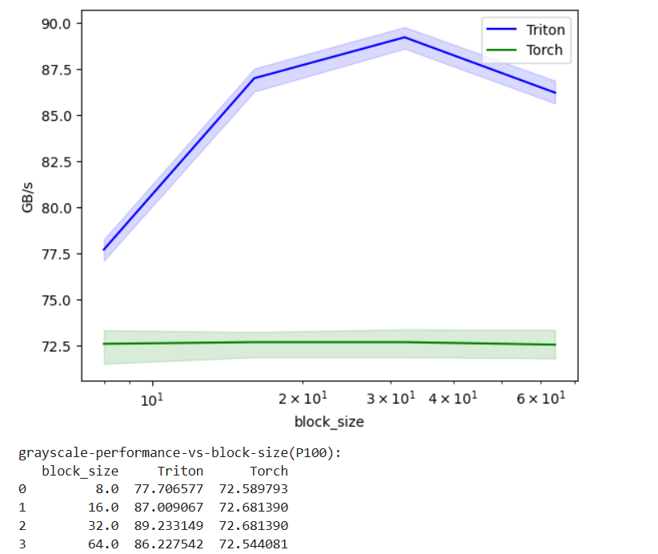
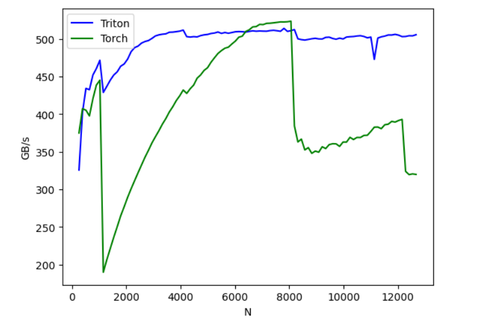

#### 100 days of CUDA Challenge

This is my attempt to write a kernel every day for the next 100 days and document my learning journey.

Mentor : https://github.com/hkproj | https://github.com/hkproj/100-days-of-gpu

Day1

1. [CheckDeviceInfo](day1/checkDeviceInfo.cu) - a kernel to understand every detail about your GPU present in the system.

Day2

2. - [VectorAdd](day2/sumArray.cu) - a kernel to do vector addition
   - learned how to configure and use nvidia nsight to profile kernels and understand bottlenecks

Day3

3. - [TritonVectorAdd](day3/vectorAdd.py) - a triton kernel to do vector addition.
   - watching the gpu mode tutorial on triton - https://www.youtube.com/watch?v=DdTsX6DQk24&ab_channel=GPUMODE

Day4

4. - [TritonGrayScale](day4/grayscale.py) - a triton kernel to grayscale an image.
   - watching the gpu mode tutorial on triton - https://www.youtube.com/watch?v=DdTsX6DQk24&ab_channel=GPUMODE

Day5

5. - [TritonGrayScaleBenchmarking](day5/grayscale_with_benchmark.py) - benchmarking the previous grayscale kernel.

Day6

6. - [SoftmaxKernel](day6/naive_softmax.py) - Implementing a naive softmax kernel.

Day7

7. - [FusedSoftmaxKernel](day7/fused_softmax.py) - Implementing the fused softmax from the triton tutorials and benchmarking against the pytorch version of it. 
Reading on what kernel warmup does.

8. - [DropoutKernel](day8/dropout.py) - Implementing a memory efficient dropout kernel in triton from the tutorials.

9. [TanhKernel](day9/tanh.py) - Implementing a tanh kernel.

10. [Sigmoidkernel](day10/sigmoid.py) - Implementing a sigmoid kernel.

11. [Selukernel](day11/selu.py) - Implementing a selu kernel.

12. [Relukernel](day12/relu.py) - Implementing a relu kernel.

13. [SwishKernel](day13/swish.py) - Implementing a swish kernel.

14. [Softpluskernel](day14/softplus.py) - Implementing a softplus kernel.

15. [LeakyRelu and Elu](day15/leaky_relu.py) - Implementing leaky relu and elu kernels.

16. [GeluKernel](day16/gelu.py) - Implementing gelu kernel.

17. [outer_add](day17/block_outer_vector_add.py) - Implementing naive and block wise outer vector add.

18. [FusedMul](day18/fused_outer_mul.py) - Implemented fused outer multiplcation along with backward.

19. [LongSum](day19/long_sum.py) - Implemented sum across a batch of numbers.

20. [LongSoftmax](day20/long_softmax.py) - Implemented numerically stable version of softmax.

21. [ScalarFlashAttention](day21/scalar_flash_attention.py) - Implemented a scalar version of flash attention.

22. [Conv2d](day22/2d_conv.py) - Implemented a simple convolution 2d kernel.

23. [BatchmatrixMul](day23/matmul.py) - Implemented matrix multiplication over a batch.

24. [QuantizedMatrixMul](day24/quantized_matmul.py) - Implemented quantized matrix multiplication.

25. Put together the solved and unsolved sasha triton puzzles. Solutions here - [tritonpuzzles](../triton-puzzles/)

26. Watching Umar Jamil lectures on Flash Attention.

27. [MishKernel](day27/mish.py) - Implementing mish kernel with bechmarking with better perf than pytorch kernels.

28. [MishwithBackward](day28/mish_with_backward.py) - Completing the backward pass for the mish kernel.

29. [Mish2dgrid](day29/mish_2dgrid.py) - Implementing mish kernel with 2d launch grid and backward pass.
