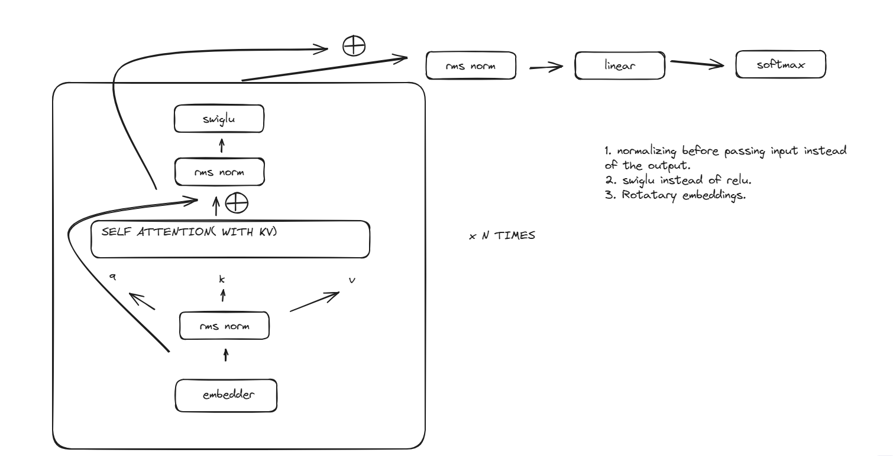

### Nano-Unsloth

This is an educational repository that provides a more approachable re-implementation of Unsloth.
This will drives references from both huggingface and unsloth and aim to document every piece of optimization.

References -
1. https://github.com/unslothai/unsloth/
2. https://github.com/huggingface/transformers/tree/main/src/transformers/models

Architectures to be implemented -
1. Llama - 

2. Llama4
3. Gemma
4. Gemma 2
5. Mistral
6. Qwen 2
7. Qwen 3