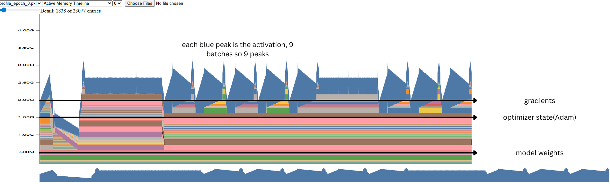

### Debugging OOMs or GPU Allocation when training neural nets!

This is a snapshot captured by the pytorch memory profiler for a sample training run for gpt-2 model. 

You can easily visualize how much memory is allocated for the model weights, optimizer states, gradients and activation peaks.

