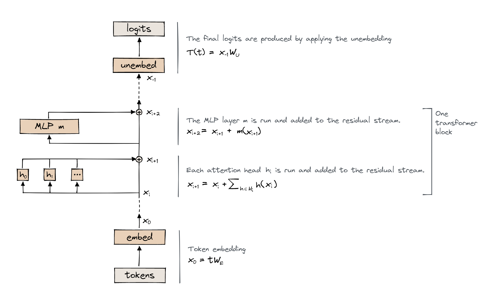

## Implementing transformers from first principles

Implementing transformer to refine my intuition on how a transformer works as a mathematical object.

- Understand that a transformer is composed of attention heads and MLPs, with each one performing operations on the residual stream
- Understand that the attention heads in a single layer operate independently, and that they have the role of calculating attention patterns (which determine where information is moved to & from in the residual stream)
- LayerNorm (transforming the input to have zero mean and unit variance)
- Positional embedding (a lookup table from position indices to residual stream vectors)
- Attention (the method of computing attention patterns for residual stream vectors)
- MLP (the collection of linear and nonlinear transformations which operate on each residual stream vector in the same way)
- Embedding (a lookup table from tokens to residual stream vectors)
- Unembedding (a matrix for converting residual stream vectors into a distribution over tokens)

